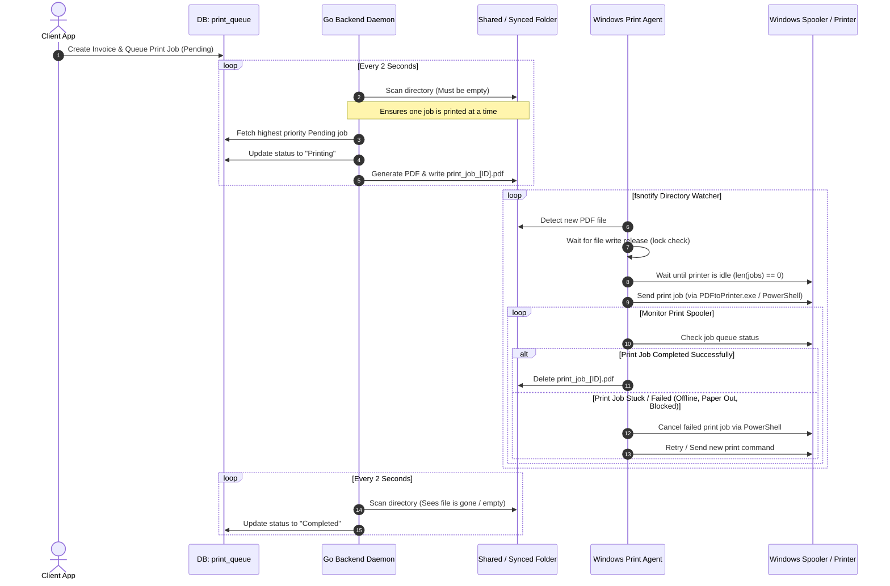
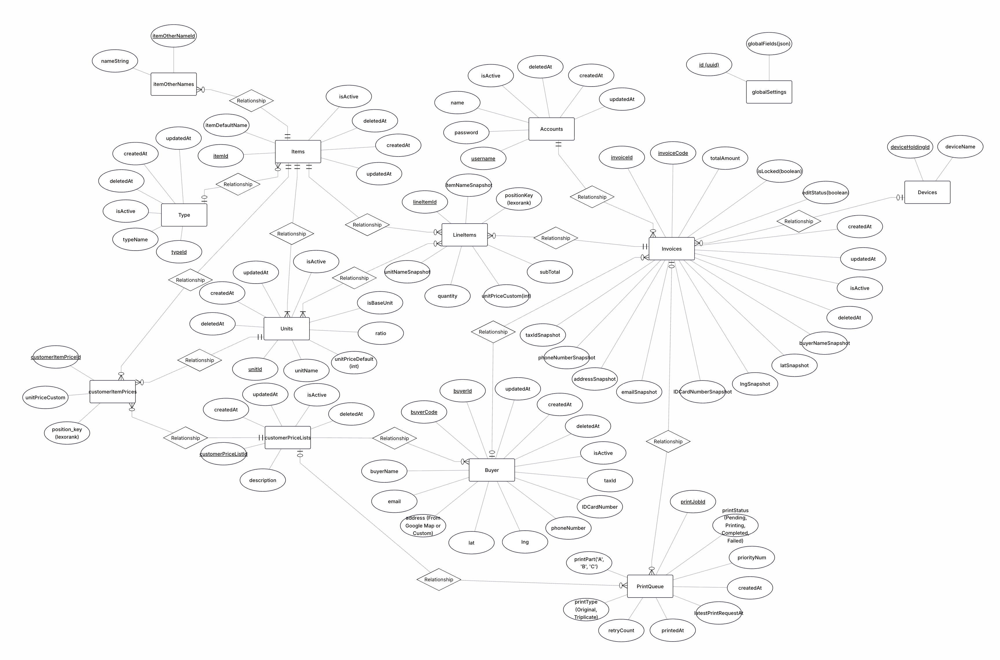

# 🧾 Invoice App - Automated Multi-Platform Invoice Management System

Welcome to **Invoice App**, a premium multi-platform (Web & Android) invoice management and tracking solution. Built with a highly standardized architecture, premium security measures, automated cloud backups, and a streamlined one-command deployment (CI/CD) pipeline.

---

## 🛠️ Technical Architecture (Tech Stack)

### 1. Backend (Go API Service)
* **Core:** Go (Golang) powered by the lightning-fast **Fiber v2** framework.
* **Database:** **PostgreSQL 16** (Alpine).
* **ORM & Query Gen:** **SQLC** (ensuring maximum performance, strict type-safety, and raw query speeds).
* **Migrations:** **Golang-Migrate** (automating database schema tracking and syncing).
* **AI Integration:** **Google Gemini API** (generates advanced contextual item naming and dynamic packaging variation structures automatically).
* **Cronjobs & Cloud Backups:** `robfig/cron` schedules database exports every 10 minutes (`*/10 * * * *`). The system invokes containerized `pg_dump`, compresses the output using gzip, uploads the backup archive directly to **Cloudflare R2** (S3-compatible API) utilizing official AWS SDK v2, and cleans up temporary local files.
* **Hot Reload:** `air` for a seamless local development experience.

### 2. Frontend (Flutter Web & Mobile)
* **Core:** Flutter (Dart) with a fully **Responsive** layout designed to run on both Web browsers and Android Phones.
* **Theme:** Dynamically adapts using `Theme.of(context).colorScheme` (Material 3) supporting unified Light and Dark modes.
* **Key Integrations:**
  * **🧠 Gemini AI Smart Product Autocomplete:** Seamless contextual product variation generator (Users input a keyword like 'Sting', and Gemini generates correct packaging variations, base unit prices, and unit ratios like crates or cans, enabling one-tap batch creation!).
  * Real-time business lookup by tax ID utilizing the **VietQR API**.
  * Address autocomplete and interactive maps via a secure **Google Maps API Proxy** (protects API keys by storing and invoking them strictly on the Go backend).
  * Automated cleanup of downloaded update APKs at startup to preserve user storage space.

### 3. Gateway & DevOps (Production)
* **Reverse Proxy:** **Nginx** (isolates API subdomains, implements SSL encryption via Cloudflare PEM certificates, and manages high-performance CORS headers natively).
* **Containerization:** **Docker** & **Docker Compose**.
* **Database Manager:** **pgAdmin 4** (strictly isolated for secure local LAN access only).

---

## 📂 Project Structure (Folder Structure)
```
Invoice_App/
├── .env                         # Deployment variables (SSH Target, DOMAIN, pgAdmin credentials)
├── env.example                  # Template configuration for the root directory
├── cd_ssh.sh                    # Automated shell script for local builds, asset packing, and remote server deploy
├── setup.sh                     # Directory initialization, SSL copying, and Nginx template renderer on the VPS
├── build_flutter.sh             # Local shell utility for compiling Flutter Web and APK assets
├── docker-compose.prod.yml       # Production-ready Docker Compose configuration
├── nginx/
│   ├── nginx.conf.template      # SSL & CORS-enabled Nginx template config
│   └── ssl/                     # Folder for Cloudflare SSL certificates (Git-ignored for security)
├── invoice_app_backend/         # Go Backend Source Code
│   ├── app/                     # Feature-based business logic (Auth, Invoice, Item, Backup...)
│   ├── db/                      # DB SQL Migration files and SQLC generated artifacts
│   ├── Dockerfile               # Production Dockerfile packed with postgresql-client
│   └── .env                     # Backend configuration (R2 buckets, DB credentials, local ports)
└── invoice_app_frontend/        # Flutter Frontend Source Code
    ├── lib/                     # UI Screens, Custom Widgets, and client API Services
    └── .env                     # Client configuration containing fallback ports and API URLs
```

---

## 💻 Developer Machine Prerequisites (Local WSL 2 / macOS / Linux)

If you are developing and deploying from a Windows machine using **WSL 2** (Windows Subsystem for Linux), macOS, or Linux, ensure your local development environment has the following tools installed:
* **Docker Desktop (with WSL 2 Integration enabled):** To build multi-platform backend images locally.
* **WSL 2 native filesystem recommendation:** Clone this repository directly inside the native WSL 2 user home directory (e.g., `~/Invoice_App`) instead of Windows-mounted paths (`/mnt/c/...`) to avoid file-watching latency with Go `air` and file permission conflicts.
* **Required tools:** Ensure Python 3, OpenSSH client, and Rsync are installed:
  ```bash
  sudo apt update && sudo apt install -y rsync openssh-client python3
  ```
* **Flutter SDK & Java JDK 17:** To compile the web assets and Android APK locally.

---

## 🚀 Remote VPS Server Prerequisites (Deploy Target Server)

Before running the auto-deployment script (`cd_ssh.sh`), ensure your remote VPS (Ubuntu/Debian server) is configured and prepared with the following:

### 1. Docker & Docker Compose V2
* Docker Engine and Docker Compose V2 must be installed on the VPS.
* The SSH deploy user must have permission to run Docker commands (i.e. added to the `docker` group) or have sudo privileges:
  ```bash
  # Verify on your VPS
  docker --version
  docker compose version
  ```

### 2. Rsync Utility Installed (CRITICAL)
* The deployment pipeline uses `rsync` to synchronize compiled Flutter Web bundles to the VPS.
* > [!WARNING]
  > **Rsync must be installed on both your local developer machine AND the remote VPS**, or the upload step will fail!
* Install it on the VPS via:
  ```bash
  sudo apt update && sudo apt install -y rsync
  ```

### 3. SSH Access & Folder Write Permissions
* Ensure SSH access is working from your local machine to the VPS (SSH key-based auth is highly recommended for automation).
* The deployment directory on the VPS (e.g., `/home/user/Invoice_App`) must exist and have write permissions for your SSH user.

### 4. Firewall & Cloud Security Group Port Openings
Ensure your VPS firewall (UFW) or Cloud Security Groups allow incoming traffic on the following ports:
* **`DEPLOY_HTTP_PORT` (Default `27080` - HTTP):** Exposes the Nginx Gateway for HTTP traffic.
* **`DEPLOY_HTTPS_PORT` (Default `27443` - HTTPS):** Exposes the Nginx Gateway for HTTPS/SSL traffic (Main endpoint for Flutter Web and Backend API).
* *Note:* Database (`5432`) and pgAdmin (`8888`) ports are kept internal and not exposed to the public internet for maximum security. pgAdmin is LAN-restricted inside Nginx.

---

## 💻 Local Development Setup (Dev Phase)

### 1. Environment Variable Configurations (.env)
* Create the required `.env` configuration files by copying their corresponding templates:
  1. Root Directory: Copy `env.example` -> `.env`
  2. Backend: Copy `invoice_app_backend/env.example` -> `invoice_app_backend/.env`
  3. Frontend: Copy `invoice_app_frontend/.env.example` -> `invoice_app_frontend/.env`

### 2. Running the Go Backend
* Generate a secure JWT signing key:
  ```bash
  python generate_jwt_key.py
  ```
* Run the backend with automatic hot-reloading via `air`:
  ```bash
  cd invoice_app_backend
  air
  ```
* If you modify any SQL schema or queries under `./db/queries/`, regenerate the SQLC code:
  ```bash
  sqlc generate
  ```

### 3. Running the Flutter Frontend
* Ensure your local development port is declared in `invoice_app_frontend/.env`:
  ```env
  BACKEND_PORT=8090
  ```
* Launch your Android Emulator or web browser, and start the app in Debug Mode via VS Code (`.vscode/launch.json`). The app detects `kDebugMode` at runtime and automatically routes requests to localhost (`http://localhost:8090` or emulator gateway `http://10.0.2.2:8090`).

---

## 🚀 Remote Server Deployment (Deploy Phase)

The deployment pipeline is fully automated using a **Local Build & Push** model. There is no need to install Flutter, Dart, or pull code from Git directly on the production server!

### Step 1: Build & Push the Go Backend Image
Whenever backend changes are ready, compile the multi-platform image and push it to Docker Hub:
```bash
cd invoice_app_backend
docker buildx build --platform linux/amd64 -t haideptrai2707/invoice_app_backend:v1 . --push
```

### Step 2: Configure VPS Credentials in the Root `.env`
Open the `.env` file at the root of the project and enter your remote VPS configurations:
```env
REMOTE_SERVER=user@your-vps-ip
REMOTE_PATH=/home/user/Invoice_App
DOMAIN=yourdomain.com
PGADMIN_DEFAULT_EMAIL=admin@yourdomain.com
PGADMIN_DEFAULT_PASSWORD=your_secure_password

# Custom exposed gateway ports (Optional - defaults to 27080 and 27443)
DEPLOY_HTTP_PORT=27080
DEPLOY_HTTPS_PORT=27443
```

### Step 2.5: Prepare SSL Certificates (Nginx Gateway)
* > [!IMPORTANT]
  > Before executing the deployment script, you **MUST** obtain your SSL Origin Certificates (e.g., from Cloudflare SSL/TLS Origin CA or Let's Encrypt).
* Create the `nginx/ssl/` directory on your local machine and place the certificate files inside:
  * Save the Certificate chain file as `nginx/ssl/fullchain.pem`
  * Save the Private key file as `nginx/ssl/privkey.pem`
* The deployment script (`cd_ssh.sh`) will verify these files exist locally and automatically upload them securely to the remote VPS. Without these two files, the script will abort to prevent Nginx container crashes.

### Step 3: Run the Auto-Deployment Script
Execute the deployment pipeline script from your local machine:
```bash
chmod +x cd_ssh.sh
./cd_ssh.sh
```

**What the `cd_ssh.sh` script does automatically:**
1. Loads VPS target variables, credentials, and custom gateway ports straight from the root `.env` (no manual input required).
2. **Executes `generate_jwt_key.py`** to automatically generate a secure random `JWT_SECRET` key for your Go backend if it's not already configured, preventing manual step overhead.
3. **Safely updates/inserts `API_URL`** into `invoice_app_frontend/.env` pointing to your target subdomain and custom port (e.g. `https://api.yourdomain.com:DEPLOY_HTTPS_PORT`) without modifying other frontend environment variables like `BACKEND_PORT`.
4. Runs Flutter Web compilation and builds the release APK locally.
5. Uploads build assets (Web bundle and APK), SSL folders, Nginx configuration templates, and `.env` configurations securely to the VPS.
6. Invokes `setup.sh` on the VPS to initialize storage directories, copies Cloudflare SSL certificates, and updates Nginx domains.
7. Pulls the latest Docker images from Docker Hub, pulls down existing containers, and restarts the environment with a clean force-recreate model!

---

## 💻 Local Production Deployment (For testing on the current machine)
If you want to run the full production environment (Docker Compose, Nginx Gateway, Production SSL) directly on your local machine:

### Step 1: Run the Setup Script
Initialize directory structures and populate Nginx templates:
```bash
chmod +x setup.sh
./setup.sh
```

### Step 2: Build Flutter Assets Locally
Compile the production Flutter Web assets and release Android APK (select `y` when prompted to clean and rebuild; the upload step will automatically be skipped since no remote server is specified):
```bash
chmod +x build_flutter.sh
./build_flutter.sh
```

### Step 3: Build the Backend Docker Image Locally
Build the Go backend image locally without pushing to the registry. The script automatically reads the tag from the `DEPLOY_DOCKER_IMAGE` variable inside your root `.env` file (or you can pass it as an argument):
```bash
chmod +x build_backend.sh
./build_backend.sh
```

### Step 4: Run Docker Compose
Because `build_backend.sh` automatically tags the local image matching the exact name from your `.env` (the same tag specified in `docker-compose.prod.yml`), you **do not** need to modify `docker-compose.prod.yml`.

Ensure your root `.env` is configured (including `PRINT_FOLDER_PATH` and `DOMAIN`), then start the containers.

**Standard start:**
```bash
docker compose -f docker-compose.prod.yml up -d
```

**Rebuild from scratch (No cache):**
If you have modified code (such as the custom Certbot Dockerfile) and want to clean up existing containers and force a rebuild:
```bash
docker compose -f docker-compose.prod.yml down && docker compose -f docker-compose.prod.yml build --no-cache && docker compose -f docker-compose.prod.yml up -d
```

---

## 🖨️ Automated PDF Printing Architecture (Decoupled Sync Queue)

The application features a decoupled, robust, and highly reliable asynchronous PDF printing system designed to connect cloud-deployed backend services with local physical printers on Windows machines.

### 🔄 Architectural Flow Diagram



### 📦 Key Components

#### 1. Database Queue (`print_queue`)
* Serves as the source of truth for print state tracking.
* Each print job holds metadata: status (`Pending`, `Printing`, `Completed`, `Failed`), `priority_num`, `print_type` (e.g. Invoices, Price Lists), and references (`invoice_id`).

#### 2. Go Backend Print Daemon (`invoice_app_backend/app/print`)
* Runs continuously in the background, polling the database and target directory (`./printing_folder`) every 2 seconds.
* **State Check:** If the target directory contains a PDF file, it waits (indicating the printer agent is still processing the current job).
* **Completion Handler:** If the directory is empty but the database shows a job is currently `Printing`, it infers the local print agent has successfully printed and deleted the file. It then marks that job as `Completed`.
* **Job Despatch:** When the folder is free, it grabs the next highest priority `Pending` job, flags it as `Printing`, compiles the invoice/item data into a PDF document, and writes it to the shared directory.

#### 3. Windows Print Agent Daemon (`invoice_app_printing_daemon`)
* A lightweight, compiled Go utility running locally on the Windows machine connected to the physical receipt/document printer.
* **Directory Watching:** Uses `fsnotify` to listen for `Create` and `Write` events on the watched directory (`watch_dir`).
* **Active Queue Check:** Before dispatching a document, it queries the Windows Spooler API to ensure the printer is online and not jammed.
* **Silent Printing:** Uses `PDFtoPrinter.exe` for silent background printing (with a PowerShell pipeline fallback: `Start-Process ... -Verb PrintTo`).
* **Printer Jam & Error Recovery:** Actively monitors individual job codes (offline, paper out, blocked). If a job fails or remains stuck for over 1 minute, it issues a command to cancel the job (`Remove-PrintJob`) and automatically triggers a retry.
* **Success Cleanup:** Once the Spooler queue clears successfully, it deletes the local PDF file. This deletion signals the backend to mark the job completed and proceed to the next invoice.

---

## 💾 Automated Database Backups (Cloudflare R2 Cronjob)
* The Go backend starts an asynchronous cron job runner at bootstrap. It is scheduled to dump the database **every 10 minutes** (`*/10 * * * *`).
* The job connects to the PostgreSQL container, compiles a gzip compressed `.sql` archive, uploads it securely to **Cloudflare R2** via an S3-compatible channel, and cleans up local temporary files immediately.
* You can manually trigger a backup to test and verify status logs by requesting:
  `GET https://api.yourdomain.com:<DEPLOY_HTTPS_PORT>/api/trigger-backup` (Requires a valid Authorization header).

---

## 🛡️ Security & Privacy Policies
The repository is secured with strict `.gitignore` filters at both the root and subproject layers to prevent database, credential, or SSL leaks:
* All private environment files (`.env`, `*.backup`, `*.tmp`) are ignored.
* Cloudflare private SSL certificate folders (`nginx/ssl/`) are entirely ignored.
* PostgreSQL database dump storage (`invoice_app_backend/backups/`) is strictly kept out of version control.

---

## 📊 Database Design (ERD)
The following diagram provides a high-level overview of the database schema and the relationships between the core entities in the **Invoice App**.

<p align="center">
  
</p>

---
*Happy deploying!* 🚀